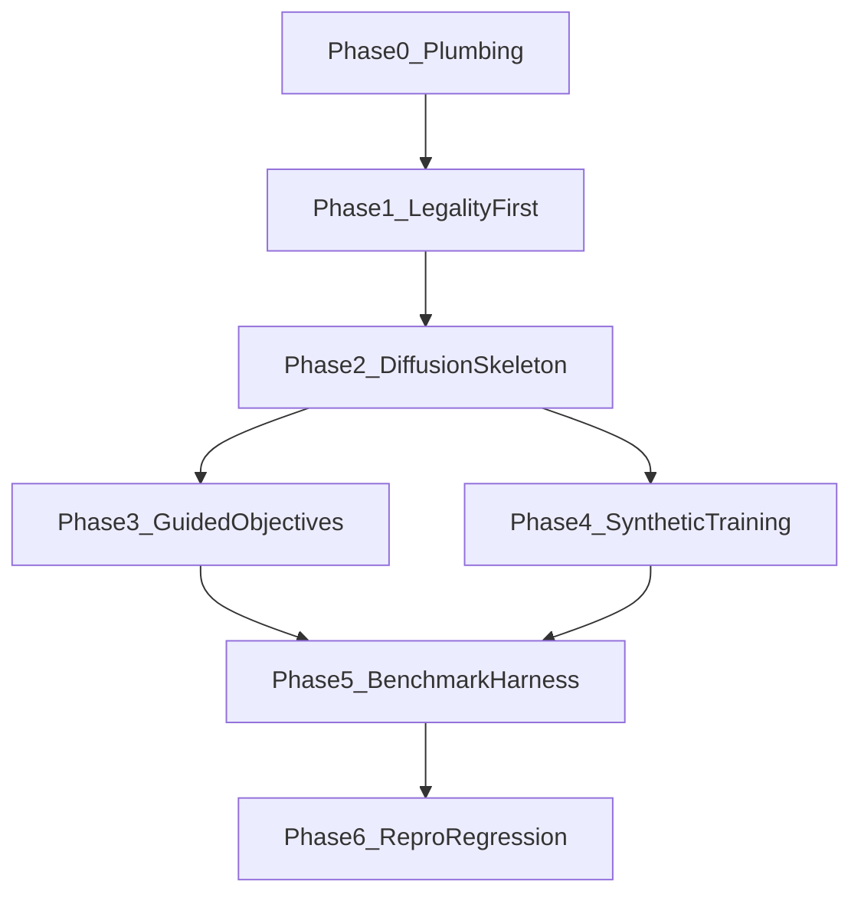

# Implementation Roadmap

This roadmap converts the current research docs into a concrete build order for a diffusion-first implementation.

## Guardrails (Locked Decisions)

- Core architecture: diffusion-first only (no RL fallback track).
- Dependency manager: `uv`.
- Hard legality: zero-overlap is mandatory.
- Tier strategy: generate diverse candidates, then pick the single best official proxy.
- Benchmark authority: 17 IBM designs (`ibm01–ibm04, ibm06–ibm18`).
- Reproducibility controls are mandatory: seeds, config snapshots, deterministic verification mode, artifact logs.

## Phase 0 - Plumbing and Competition Wiring

Purpose: create a runnable skeleton that can execute `generate -> legalize -> evaluate` from one command.

Deliverables:

- Python project scaffold with `uv`.
- Standard package layout and CLI entrypoint.
- Evaluator integration plan and local adapter contract.
- Official challenge repository added as submodule under `external/`.
- Mixed-size wrapper contract to lock macro locations and call standard-cell clustering/placement backend (DREAMPlace/hMETIS interface).

Done criteria:

- One command exists that runs end-to-end on a benchmark input (stubbed internals acceptable at this phase).
- The pipeline returns structured outputs and a candidate ranking table.

Risks:

- External evaluator APIs may shift.
- Submodule onboarding can stall early progress if not isolated behind adapters.

## Phase 1 - Legality-First Baseline

Purpose: guarantee valid placements before optimization quality.

Deliverables:

- Geometry primitives and overlap detection.
- Robust greedy legalizer.
- Zero-overlap assertions with explicit pass/fail status.
- Fast mixed-size handoff path for proxy-ready evaluation after macro legalization.

Done criteria:

- Pipeline never emits overlapping final placements.
- Legalizer behavior is deterministic under fixed seed/config.

Risks:

- Over-aggressive legalization can damage proxy score.
- Runtime drift if legalizer search becomes too broad.

## Phase 2 - Diffusion Inference Skeleton

Purpose: establish the diffusion runtime path and candidate batching.

Deliverables:

- DDPM sampler interfaces and model stubs.
- Candidate batch generation plumbing.
- Reproducibility hooks: run id, seed locking, config snapshot, artifact manifest.
- Architecture guardrail tests to prevent accidental RL branch creep.

**Implementation status (this repo):** Done. Code: [`src/hrt_chip/diffusion.py`](../src/hrt_chip/diffusion.py) (`DiffusionSampler`, `DeterministicDDPMStubSampler`, normalized `[-1, 1]` centers), generate stage ([`src/hrt_chip/stages/generate.py`](../src/hrt_chip/stages/generate.py)), `results.json` field `sampler_provenance`, tests in [`tests/test_diffusion_guardrails.py`](../tests/test_diffusion_guardrails.py). PyTorch, ResGNN/AttGNN, and training remain **Phase 4**.

Done criteria:

- Batched candidate generation works through the full pipeline.
- All outputs are traceable to a saved run manifest.

Risks:

- Interface churn before model internals stabilize.
- Throughput regressions from premature strict determinism.

## Phase 3 - Guided Objectives and Pareto Batch Selection

Purpose: add inference-time objective steering and strict final selection policy.

Deliverables:

- Guidance interfaces for HPWL, congestion proxy, legality potential.
- Multi-weight candidate sweep.
- Candidate scoring table and strict final selection (`argmin` official proxy).

Done criteria:

- Pipeline explores multiple objective balances in one run.
- Final candidate is always selected by official proxy only.

Risks:

- Surrogate mismatch can create noisy ranking before full evaluator pass.

**Implementation status (this repo):** Done. Guidance/objective surrogates and scoring table: [`src/hrt_chip/guidance.py`](../src/hrt_chip/guidance.py); `DiffusionSampleRequest.guidance` + stub bias in [`src/hrt_chip/diffusion.py`](../src/hrt_chip/diffusion.py); multi-weight sweep in [`src/hrt_chip/stages/generate.py`](../src/hrt_chip/stages/generate.py); `RunConfig.guidance_preset` / `guidance_weights_sweep` in [`src/hrt_chip/config.py`](../src/hrt_chip/config.py); pipeline `scoring_table`, `guidance_sweep_resolved`, strict `argmin` proxy selection in [`src/hrt_chip/pipeline.py`](../src/hrt_chip/pipeline.py); CLI `--guidance-preset`, `--guidance-weight`; tests in [`tests/test_phase3_guidance.py`](../tests/test_phase3_guidance.py).

## Phase 4 - Synthetic Data and Minimal Training Loop

Purpose: support diffusion training based only on synthetic layouts.

Deliverables:

- Synthetic data generation pipeline (v1 small -> v2 larger style).
- Train/infer orchestration using PyTorch (PyG-ready graph adapters).
- Dataset/version metadata stored in run artifacts.

Done criteria:

- Model can train and run inference with reproducible configs.
- Data generation and training are scriptable from CLI.

Risks:

- Synthetic distribution gaps vs target benchmark structures.

## Phase 5 - Benchmark Harness and Milestone Gates

Purpose: operationalize progress against competition thresholds.

Deliverables:

- Automated sweep for all 17 IBM benchmarks.
- Standard run reports (runtime, legality, proxy by benchmark, average proxy).
- Milestone gates:
  - Gate A: 100% legal placements.
  - Gate B: beat SA baseline aggregate proxy.
  - Gate C: beat RePlAce baseline aggregate proxy.

Done criteria:

- Single command runs full benchmark sweep and prints gate status.

Risks:

- Runtime budget pressure from high `K` candidate counts.

## Phase 6 - Reproducibility and Regression Controls

Purpose: ensure repeatable results and stable progress over time.

Deliverables:

- Deterministic verification mode.
- Full run manifests and replay command support.
- Artifact retention policy for candidate-level score auditing.
- CI smoke path for end-to-end pipeline integrity (quick benchmark subset).

Done criteria:

- Any run can be replayed from its manifest.
- CI catches regressions in legality, selection logic, and command wiring.

Risks:

- Deterministic mode can reduce performance if used indiscriminately.

## Dependency Flow

